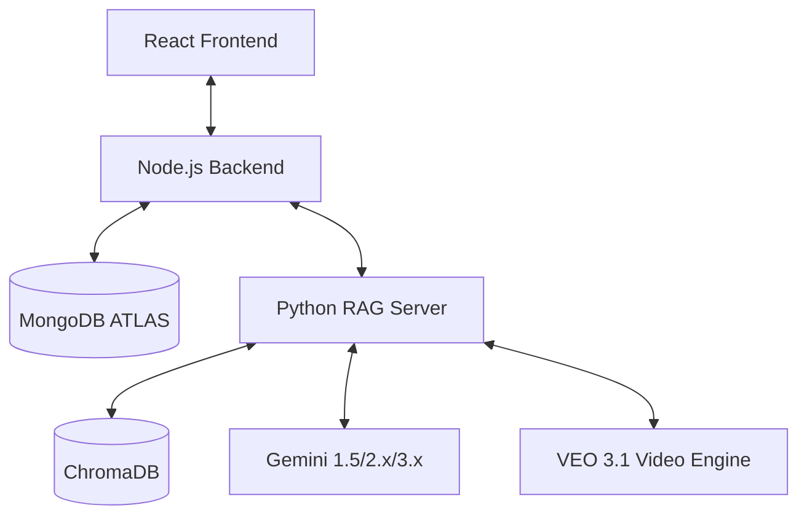
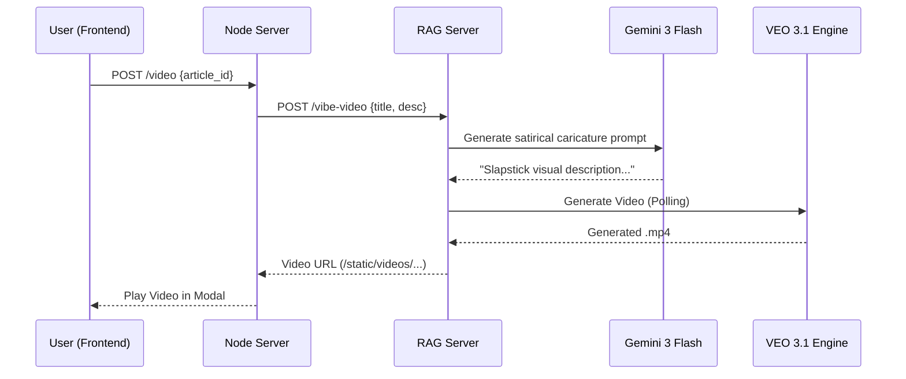

# Newsie Architecture

Newsie is a sophisticated, three-tier news platform that leverages advanced AI to provide personalized, high-engagement news experiences. The system is divided into three primary services that communicate via REST APIs.

## System Overview

---

## 1. Frontend (React 19 + Vite + Tailwind 4)

The Newsie frontend is designed with a premium, high-aesthetic "News Hub" interface. It focuses on micro-interactions and smooth transitions to keep users engaged.

- **Stack**: React 19, Tailwind CSS 4, Framer Motion (Animations), Lucide (Icons), Radix UI.
- **Key Features**:
  - **Dynamic News Grid**: Real-time personalized news feed.
  - **Vibe Adaptation**: Instant UI-level translation and tone-shifting (e.g., "Gen-Z", "Professional").
  - **AI Video Modal**: Dedicated premium player for "So Sorry" style AI animations.
  - **Real-time Tracking**: Integrated with Socket.io for live updates.

---

## 2. Backend (Node.js + Express 5)

The Node.js backend serves as the primary orchestrator, handling authentication, data persistence, and proxying complex AI requests to the RAG server.

- **Stack**: Express 5, Mongoose (MongoDB), JWT, Socket.io, node-fetch.
- **Key Services**:
  - **Personalization Engine**: Caches user-specific news adaptations (tone/language) to save LLM tokens.
  - **Article Management**: Handles the ingestion of news articles and their manual/automated tagging.
  - **AI Proxy**: All requests for Story Arc routing, Vibe Translation, and AI Video generation are proxied to the Python RAG server for specialized processing.

---

## 3. RAG & AI Server (Python + FastAPI)

The Python service is the "brain" of the platform, handling all Retrieval-Augmented Generation (RAG) tasks and high-performance AI model integrations.

- **Stack**: FastAPI, ChromaDB, Google GenAI SDK (Gemini 3 Flash, Gemini 2.5 Flash Lite, VEO 3.1).
- **Core Components**:
  - **Story Arc Router**: Uses a "Gatekeeper" pattern (Gemini 3 Flash) to evaluate if news articles belong to existing or new narrative arcs.
  - **Vibe Translator**: Efficiently rewrites news content into requested tones/languages using Gemini 2.5 Flash Lite.
  - **Vibe Video Generator**: A two-stage pipeline that uses Gemini to script satirical "So Sorry" caricatures and VEO 3.1 to render 15-60s animations.

### AI Video Generation Pipeline

---

## Data Persistence & Storage

- **MongoDB**: Stores user profiles, global news articles, story arc metadata, and personalization caches.
- **ChromaDB**: High-speed vector database for semantic similarity checks and topic routing.
- **Local Storage**: The RAG server serves generated videos and static assets via FastAPI `StaticFiles`.
